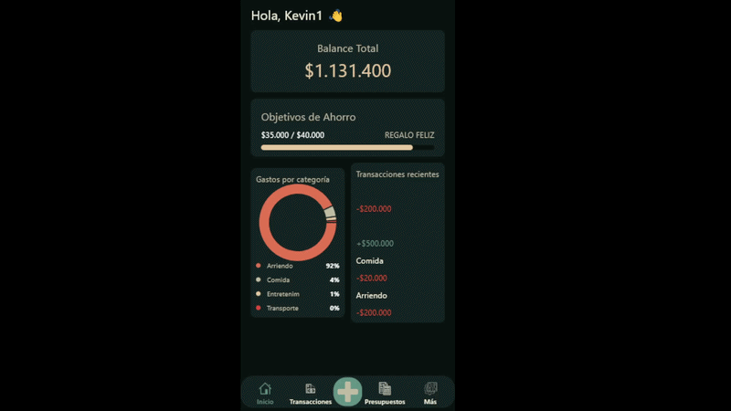

#  Gestor de Finanzas Personales

<p align="center">
  
</p>

App de escritorio para gestión de finanzas personales construida con Python y Flet. Permite registrar ingresos y gastos, visualizar presupuestos, establecer metas de ahorro y generar reportes exportables.

> Proyecto personal en desarrollo activo — construido desde cero con arquitectura escalable para agregar un modo "Negocio" en versiones futuras.

---

##  Funcionalidades

- **Autenticación** — registro, login y sesión persistente entre cierres
- **Transacciones** — registro de ingresos y gastos con categoría, cuenta y fecha
- **Múltiples cuentas** — efectivo, banco, tarjeta y más, con saldo independiente
- **Presupuestos** — límites mensuales por categoría con barra de progreso y alertas
- **Objetivos de ahorro** — metas con seguimiento de aportes y porcentaje de avance
- **Reportes** — gráfico de gastos por categoría, resumen mensual, comparativa de meses y exportación a CSV y Excel
- **Categorías personalizadas** — además de las categorías por defecto, el usuario puede crear las propias

---

##  Stack

| Tecnología | Uso |
|---|---|
| Python 3.11+ | Lenguaje principal |
| Flet | UI multiplataforma (desktop y mobile) |
| SQLite | Base de datos local por usuario |
| bcrypt | Hash seguro de contraseñas |
| openpyxl | Exportación a Excel |

---

##  Arquitectura

El proyecto sigue una separación clara de responsabilidades:

```
gestor_finanzas/
├── main.py              # Punto de entrada y navegación
├── app/
│   ├── database.py      # Conexión SQLite y funciones CRUD
│   ├── auth.py          # Autenticación y sesión persistente
│   ├── logic.py         # Lógica de negocio y cálculos
│   ├── components.py    # Componentes visuales reutilizables
│   ├── theme.py         # Paleta de colores y estilos globales
│   ├── utils.py         # Helpers de fechas y formato de moneda
│   └── views/           # Una pantalla = un archivo
│       ├── login.py
│       ├── register.py
│       ├── dashboard.py
│       ├── transactions.py
│       ├── budgets.py
│       ├── savings.py
│       ├── reports.py
│       ├── add_transaction.py
│       └── settings.py
└── assets/
```


---

##  Instalación

**Requisitos:** Python 3.11 o superior

```bash
# 1. Clonar el repositorio
git clone https://github.com/Keiv-sn/gestor-finanzas.git
cd gestor-finanzas

# 2. Crear entorno virtual (recomendado)
python -m venv env
source env/bin/activate        # Linux / Mac
env\Scripts\activate           # Windows

# 3. Instalar dependencias
pip install -r requirements.txt

# 4. Ejecutar
python main.py
```

La base de datos se crea automáticamente en `~/.gestor_finanzas/finanzas.db` al primer inicio. No requiere configuración adicional.

---

##  Distribución como ejecutable

```bash
pyinstaller build.spec
```

El `.exe` generado en `/dist` funciona sin Python instalado.

---

## 🗺️ Roadmap

- [x] Autenticación con sesión persistente
- [x] Gestión de transacciones, cuentas y categorías
- [x] Presupuestos mensuales con alertas
- [x] Objetivos de ahorro con aportes
- [x] Reportes y exportación CSV / Excel
- [ ] Modo PYME — facturación, gastos con RUT proveedor
- [ ] Sincronización opcional en la nube


---

##  Diseño

Interfaz oscura con layout tipo Bento Box, optimizada para mobile.

Paleta de colores:

| Token | Color | Uso |
|---|---|---|
| `BG_PRIMARY` | `#08110F` | Fondo principal |
| `BG_SECONDARY` | `#142323` | Tarjetas y paneles |
| `ACCENT_GREEN` | `#619184` | Ingresos y acciones |
| `ACCENT_ORANGE` | `#E37451` | Gastos y alertas |
| `ACCENT_YELLOW` | `#E6C99F` | Destacados y balance |

---

##  Autor

Desarrollado por **[Keiv]**


---

##  Licencia

MIT License — libre para usar, modificar y distribuir.
